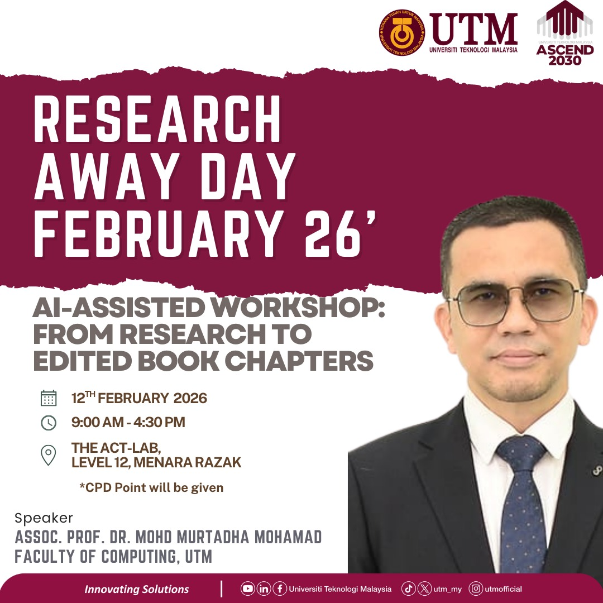
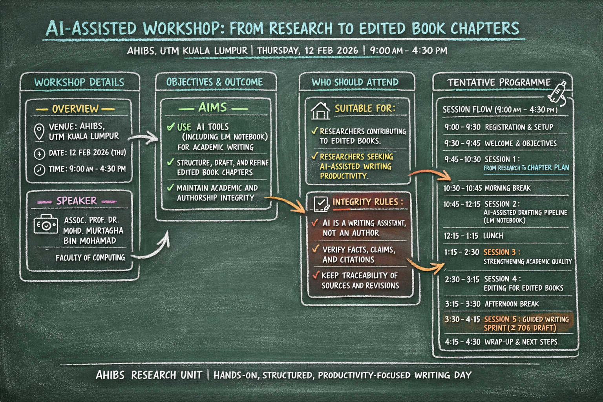
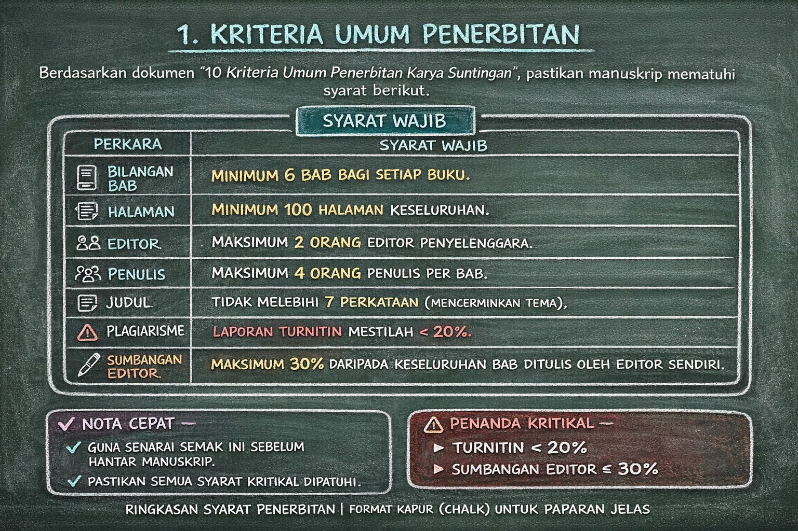

# Panduan Penerbitan Buku Karya Suntingan (Edited Book) - Penerbit UTM Press

Repositori ini mengandungi panduan lengkap, senarai semak, dan alat bantu (AI Prompts) untuk penulis dan editor yang ingin menerbitkan **Buku Karya Suntingan** di bawah [Penerbit UTM Press](https://penerbit.utm.my).

## 📚 Isi Kandungan
1. [Kriteria Umum Penerbitan](#1-kriteria-umum-penerbitan)
2. [Format & Atur Huruf (Typesetting)](#2-format--atur-huruf-typesetting)
3. [Struktur Kandungan Buku](#3-struktur-kandungan-buku)
4. [Proses Penyerahan (E-Press)](#4-proses-penyerahan-e-press)
5. [AI Prompts untuk Penulisan](#5-ai-prompts-untuk-penulisan)
6. [Senarai Semak Akhir](#6-senarai-semak-akhir)

---

## 1. Kriteria Umum Penerbitan

Berdasarkan dokumen *10 Kriteria Umum Penerbitan Karya Suntingan*, pastikan manuskrip anda mematuhi syarat berikut:

| Perkara | Syarat Wajib |
| :--- | :--- |
| **Bilangan Bab** | **Minimum 6 bab** bagi setiap buku. |
| **Halaman** | **Minimum 100 halaman** keseluruhan. |
| **Editor** | Maksimum **2 orang** editor penyelenggara. |
| **Penulis** | Maksimum **4 orang** penulis per bab. |
| **Judul** | Tidak melebihi **7 perkataan** (mencerminkan tema). |
| **Plagiarisme** | Laporan Turnitin mestilah **< 20%**. |
| **Sumbangan Editor** | Maksimum **30%** daripada keseluruhan bab ditulis oleh Editor sendiri. |
| **Bab 1** | Mesti ditulis oleh Editor sebagai pengenalan & rangkuman bab lain. |

---


## 2. Format & Atur Huruf (Typesetting)

Penyediaan manuskrip mesti menggunakan templat MS Word yang disediakan oleh UTM Press.

### Spesifikasi Teks
*   **Font:** Baskerville (Perlu diinstall: `Font_Baskerville.ttc`).
*   **Saiz Buku:** 6.5 inci x 9.5 inci.
*   **Jidar (Margins):**
    *   Atas/Bawah/Dalam: 1.0 inci
    *   Luar: 0.75 inci
    *   Header/Footer: 0.5 inci

### Gaya Penulisan (Styles)
*   **Tajuk Bab:** *Heading 1* (Baskerville 20pt, Bold).
*   **Sub-tajuk (X.1):** *Heading 2* (Baskerville 12pt, Uppercase, Bold).
*   **Sub-sub-tajuk (X.1.1):** *Heading 3* (Baskerville 12pt, Capitalize Each Word).
*   **Perenggan (Body Text):**
    *   Alignment: **Justified**.
    *   Perenggan pertama selepas tajuk: **Tiada Inden** (No indentation).
    *   Perenggan seterusnya: **Inden 0.25 cm**.

### Rajah & Jadual
*   **Kapsyen Rajah:** Letak di **BAWAH**. Format: **Figure X.1 Title**.
*   **Kapsyen Jadual:** Letak di **ATAS**. Format: **Table X.1 Title**.
*   **Wajib:** Semua rajah/jadual mesti disebut dalam teks (cth: "seperti dalam Rajah 2.1").

### Rujukan
*   Gunakan gaya **APA Edisi ke-7 (APA 7th Edition)**.
*   Senarai rujukan diletakkan di akhir setiap bab.

---

## 3. Struktur Kandungan Buku

Setiap buku mesti mengandungi komponen berikut mengikut turutan:

1.  **Bahagian Awal (Prelims):**
    *   Halaman Tajuk & Hak Cipta.
    *   **Kandungan (Contents):** Senarai bab dan muka surat.
    *   **Prakata (Preface):** Menjelaskan tujuan, sasaran pembaca, dan struktur buku.
    *   **Senarai Penyumbang:** Nama penuh dan afiliasi penulis.

2.  **Bahagian Teks (Chapters):**
    *   Bab 1 (Pengenalan oleh Editor).
    *   Bab-bab seterusnya (Isi Kandungan).

3.  **Bahagian Akhiran (End Matter):**
    *   **Indeks:** Senarai kata kunci penting berserta nombor muka surat (Disarankan guna fungsi MS Word Index).

---

## 4. Proses Penyerahan (E-Press)

Semua penyerahan dilakukan melalui sistem **UTM E-Press**.

1.  **Daftar Akaun:** Layari `https://epress.utm.my/` dan daftar.
2.  **Pilih Kategori:** Pilih "UTM Press - Edited Book".
3.  **Muat Naik Fail:**
    *   Manuskrip lengkap (Word).
    *   Borang Cadangan (Proposal Form).
    *   CV Editor & CV Penilai.
    *   Laporan Turnitin (<20%).
    *   Borang Kebenaran (Permission Verification) jika ada bahan hak cipta lain.

---

## 5. AI Prompts untuk Penulisan

Gunakan *prompt* ini dalam ChatGPT/Claude untuk membantu mempercepatkan proses penulisan bab yang mematuhi format UTM Press.

### A. Prompt Menulis Bab Baru (Umum)

```text
Role: Bertindak sebagai penulis akademik profesional untuk Buku Karya Suntingan (Edited Book) Penerbit UTM Press.

Tugas: Tulis satu bab lengkap (Chapter [Nombor]) bertajuk "[Tajuk Bab]" (Maksimum 7 perkataan).

Konteks Buku: Tema buku adalah "[Tema Buku]".
Poin Utama Bab:
- [Poin 1]
- [Poin 2]
- [Poin 3]

Format Wajib (UTM Press Styles):
1. Struktur:
   - X.1 PENGENALAN (Introduction)
   - X.2 [TAJUK UTAMA] (Gunakan sistem nombor X.1, X.1.1)
   - X.3 KESIMPULAN
   - RUJUKAN (APA 7th Edition)
2. Gaya Teks:
   - Bahasa: [Melayu/Inggeris]
   - Perenggan pertama selepas tajuk: TIADA INDEN.
   - Perenggan seterusnya: INDEN 0.25 cm.
   - Text Alignment: Justified.
3. Kandungan:
   - Sertakan sekurang-kurangnya 1 cadangan Rajah/Jadual.
   - Wajib sebut rajah dalam teks (cth: "seperti dalam Rajah X.1").

Output: Hasilkan draf bab lengkap dari Pengenalan hingga Rujukan.
```

### B. Prompt Tukar Tesis ke Bab Buku

Gunakan *prompt* ini jika anda mempunyai fail tesis (PDF) dan ingin menukarnya menjadi satu bab buku.

```text
Role: Bertindak sebagai editor akademik profesional.
Tugas: Adaptasi kandungan daripada Tesis Pelajar yang dilampirkan ini menjadi satu Bab Buku Karya Suntingan (Edited Book Chapter).

Arahan Transformasi:
1. Ringkaskan tesis (50+ halaman) menjadi 15-20 halaman (3,000-4,000 patah perkataan).
2. Tulis Semula (Paraphrase): Elak plagiarisme. Turnitin mesti <20%. Ubah struktur ayat akademik.
3. Struktur Baru:
   - Gabung Bab 1 (Intro) & Bab 2 (Literatur) -> Pengenalan & Latar Belakang.
   - Gabung Bab 3 (Metodologi) & Bab 4 (Analisis) -> Metodologi & Perbincangan.
   - Fokus pada hasil dapatan utama.

Format UTM Press:
- Tajuk: Baru & Menarik (<7 perkataan).
- Penulis: Nama tanpa gelaran, Afiliasi (Fakulti, Universiti).
- Penomboran: Gunakan sistem perpuluhan (X.1, X.1.1).
- Rajah/Jadual: Pilih maks 3-5 yang paling kritikal. Letak kapsyen (Rajah di bawah, Jadual di atas).
- Rujukan: Pilih 10-15 yang terkini (APA 7th Ed).

Sila hasilkan kandungan bab sekarang berdasarkan fail PDF ini.
```

---

## 6. Senarai Semak Akhir

Sebelum menghantar ke E-Press, semak perkara ini:

- [ ] Manuskrip dalam format Microsoft Word (.docx).
- [ ] Menggunakan Templat BC (Baskerville font).
- [ ] Abstrak Buku & Abstrak Bab disertakan.
- [ ] Prakata (Preface) & Kandungan (TOC) disertakan.
- [ ] Rajah/Jadual jelas, bernombor, dan disebut dalam teks.
- [ ] Rujukan konsisten format APA 7.
- [ ] Laporan Turnitin < 20% dilampirkan.
- [ ] Borang Kebenaran (Permission Verification) ditandatangani.
- [ ] Semua penulis bersetuju untuk penerbitan.

---
*Nota: Dokumen ini adalah ringkasan untuk rujukan pantas. Sila rujuk laman web rasmi Penerbit UTM Press untuk maklumat terkini.*
